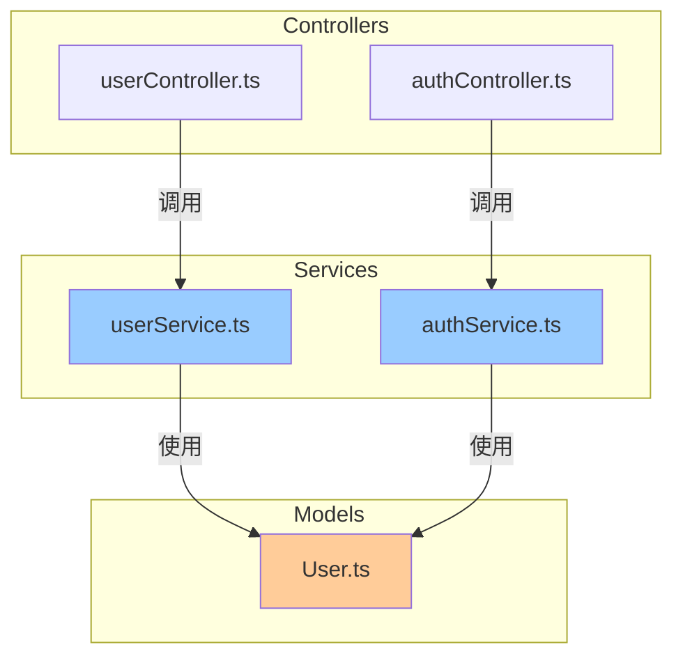

# 项目多级索引系统 (Project Multi-level Index)

<div align="center">

> 受《哥德尔、埃舍尔、巴赫》启发的分形自指文档系统
>
> 让代码项目如赋格曲般自我指涉、自我维护、优雅和谐

[](https://github.com/Claudate/project-multilevel-index/releases)
[](I18N_GUIDE.md)
[](LICENSE)
[](https://claude.ai/code)
[](CONTRIBUTING.md)

**🔧 Claude Code 插件** | [简体中文](#) | [English](README_EN.md)

</div>

---

## ⚠️ 重要说明

**这是一个 Claude Code 插件项目，不是独立工具！**

- ✅ **需要安装 Claude Code**: https://claude.ai/code
- ❌ **不支持 Cursor、Windsurf、VSCode** (计划 v2.1 支持)
- 📦 **安装位置**: `~/.claude/plugins/` (Claude Code 插件目录)

---

---

## 📖 核心理念

这是一个三级分形文档系统，自动维护项目的索引和依赖关系：

```
PROJECT_INDEX.md (根索引)
  ├─ 项目概览、架构说明
  ├─ 目录结构导航
  └─ Mermaid 依赖关系图

每个文件夹/
  └─ FOLDER_INDEX.md (文件夹索引)
       ├─ 3 行架构说明
       ├─ 文件清单
       └─ "本文件夹变化时，更新我"

每个文件
  └─ 文件头注释
       ├─ Input: 依赖什么
       ├─ Output: 提供什么
       ├─ Pos: 在系统中的定位
       └─ "我被更新时，更新我的注释和索引"
```

### 三大特性

- **🔄 自相似性**：每个层级都有相同的索引结构
- **🪞 自指性**：每个文档都声明"当我变化时，更新我"
- **🎼 复调性**：代码与文档相互呼应，局部影响整体

### 🌍 v2.0 新特性

- **完整国际化**: 支持中英文双语切换
- **模块化架构**: SKILL.md 从 1098行 精简到 200行
- **命令独立**: 每个命令都有详细实现文档
- **新命令**: `/set-language` 快速切换语言

---

## 🚀 快速开始

### 1. 安装插件

**从 GitHub 安装**（推荐）:

```bash
git clone https://github.com/YOUR_USERNAME/project-multilevel-index.git
cd project-multilevel-index

# Windows (PowerShell)
Copy-Item -Path . -Destination "$env:USERPROFILE\.claude\plugins\project-multilevel-index" -Recurse

# macOS/Linux
cp -r . ~/.claude/plugins/project-multilevel-index
```

**或手动安装**：
1. 下载 [最新版本](https://github.com/YOUR_USERNAME/project-multilevel-index/releases)
2. 解压到 Claude Code 插件目录
3. 重启 Claude Code

📖 **详细安装指南**: [INSTALL_GUIDE.md](INSTALL_GUIDE.md)

**插件目录位置**：
- Windows: `%USERPROFILE%\.claude\plugins\`
- macOS/Linux: `~/.claude/plugins/`

### 2. 启用插件

在 Claude Code 中运行：

```
/plugins enable project-multilevel-index
```

### 3. 初始化索引

在您的项目根目录运行：

```
/init-index
```

Claude 会自动：
1. 扫描项目中的所有代码文件
2. 为每个文件添加 Input/Output/Pos 头注释
3. 在每个文件夹生成 FOLDER_INDEX.md
4. 在根目录生成 PROJECT_INDEX.md 和依赖关系图

### 4. 自动更新

启用后，每次修改代码文件时，索引会自动更新（通过 PostToolUse Hook）。

---

## 📚 命令列表

| 命令 | 功能 | 使用场景 |
|------|------|---------|
| `/init-index` | 初始化索引系统 | 首次使用或重建索引 |
| `/update-index` | 手动更新索引 | 大量修改后同步索引 |
| `/check-index` | 一致性检查 | 验证索引完整性 |

---

## 💡 使用示例

### 示例 1：初始化新项目

```
User: /init-index

Claude: 确认当前目录是 h:/my-project 吗？

User: 是的

Claude:
正在扫描项目...
发现:
- TypeScript: 45 文件
- Python: 12 文件

正在生成索引...
✅ 完成！

已生成:
- 57 个文件头注释
- 8 个 FOLDER_INDEX.md
- 1 个 PROJECT_INDEX.md
- 依赖关系图包含 32 个节点

请查看 PROJECT_INDEX.md 了解项目架构。
```

### 示例 2：自动更新

当您修改文件时，索引会自动更新：

```
[您编辑 src/services/authService.ts，新增 import bcrypt]

Claude (静默):
检测到结构性变更
→ 更新 authService.ts 文件头
→ 更新 services/FOLDER_INDEX.md
→ 更新 PROJECT_INDEX.md 依赖图

[显示提示]
[索引系统] 已自动更新 authService.ts 的索引
```

### 示例 3：检查一致性

```
User: /check-index

Claude:
索引一致性检查报告
==================

✅ 文件头完整性: 55/57 (2 个文件缺少注释)
  - src/utils/legacy.js
  - src/temp/test.ts

✅ 文件夹索引: 8/8 正常
⚠️ 依赖关系: 发现 1 个循环依赖
  - src/a.ts → src/b.ts → src/c.ts → src/a.ts
✅ 索引结构: 符合规范

建议:
1. 运行 /update-index 补充缺失注释
2. 重构循环依赖
```

---

## 🎨 文件头注释示例

### JavaScript/TypeScript

```typescript
/**
 * Input: express, bcrypt, ./models/User, ./middleware/auth
 * Output: router (Express Router), POST /login, POST /register
 * Pos: API层-认证路由，处理用户登录注册
 *
 * 本注释在文件修改时自动更新
 */

import express from 'express';
import bcrypt from 'bcrypt';
// ...
```

### Python

```python
"""
Input: flask, sqlalchemy, .models.User, .schemas.UserSchema
Output: UserController 类, /api/users 路由
Pos: API层-用户控制器，处理用户 HTTP 请求

本注释在文件修改时自动更新
"""

from flask import Blueprint
# ...
```

### Rust

```rust
//! Input: actix_web, sqlx, crate::models::User
//! Output: pub fn configure_routes(), pub async fn get_users()
//! Pos: API层-用户路由处理器
//!
//! 本注释在文件修改时自动更新

use actix_web::{web, HttpResponse};
// ...
```

更多语言模板见 [skills/project-multilevel-index/templates/](skills/project-multilevel-index/templates/)

---

## 🧩 支持的语言

- ✅ JavaScript / TypeScript
- ✅ Python
- ✅ Java / Kotlin
- ✅ Rust
- ✅ Go
- ✅ C / C++
- ✅ PHP (Laravel / Plain PHP)
- ✅ Ruby (Rails / Sinatra)
- ✅ Swift (SwiftUI / UIKit)
- ✅ C# (.NET / ASP.NET Core)

**总计 10 种主流编程语言！**

---

## ⚙️ 配置

### 自定义排除规则

创建 `.claude/index-config.json`:

```json
{
  "exclude": {
    "patterns": [
      "**/node_modules/**",
      "**/.git/**",
      "**/dist/**",
      "**/build/**",
      "**/custom-folder/**"
    ],
    "useGitignore": true
  },
  "index": {
    "autoUpdate": true,
    "maxDepth": 5,
    "minFilesForFolder": 2
  },
  "visualization": {
    "maxNodes": 50,
    "groupByFolder": true,
    "showLabels": true
  }
}
```

### 禁用自动更新

编辑 `hooks/hooks.json`，移除 `PostToolUse` Hook 配置。

---

## 🔍 工作原理

### 自动更新流程

```
用户修改文件
    ↓
PostToolUse Hook 触发
    ↓
SKILL.md 中的逻辑判断
    ↓
是否为代码文件？→ 否 → 跳过
    ↓ 是
是否为索引文件？→ 是 → 跳过（防止循环）
    ↓ 否
是否为结构性变更？→ 否 → 跳过
    ↓ 是
执行级联更新
    ├─ 更新文件头注释
    ├─ 更新 FOLDER_INDEX.md
    └─ 更新 PROJECT_INDEX.md
```

### 智能判断

| 变更内容 | 是否更新 |
|---------|---------|
| 新增/删除 import | ✅ 是 |
| 修改函数签名 | ✅ 是 |
| 新增/删除 export | ✅ 是 |
| 函数内部实现 | ❌ 否 |
| 注释修改 | ❌ 否（除文件头） |
| 格式化代码 | ❌ 否 |

---

## 📊 依赖关系图示例

生成的 Mermaid 图可在 GitHub、VSCode、Obsidian 等工具中渲染：



---

## 🛠️ 故障排除

### 问题 1: 索引未自动更新

**检查**：
1. Hook 是否已启用？查看 `hooks/hooks.json`
2. 修改的是否为代码文件？
3. 是否为结构性变更？（仅修改函数内部不会触发）

**解决**：手动运行 `/update-index`

### 问题 2: 文件头注释格式不对

**原因**：可能是语言检测错误或文件已有非标准注释

**解决**：
1. 查看 `templates/` 目录下的标准模板
2. 手动调整文件头格式
3. 运行 `/update-index` 重新生成

### 问题 3: 依赖图过于复杂

**解决**：
1. 在配置中设置 `maxNodes: 30`（减少节点数）
2. 使用文件夹级别聚合视图
3. 手动编辑 PROJECT_INDEX.md，隐藏不重要的模块

---

## 🤝 贡献

欢迎提交 Issue 和 Pull Request！

改进建议：
- [ ] 支持更多编程语言
- [ ] 自定义文件头模板
- [ ] 图形化依赖分析
- [ ] 与 IDE 集成（VSCode 扩展）

---

## 📜 许可证

MIT License - 自由使用、修改和分发

---

## 🎓 灵感来源

本插件受道格拉斯·霍夫施塔特的《哥德尔、埃舍尔、巴赫：集异璧之大成》启发，实现了：

- **自指性**：文档指向自己，声明"更新我"
- **递归性**：索引的索引的索引...
- **怪圈**：代码→文档→代码的无限循环
- **分形**：每个层级都是整体的缩影

**让代码项目如赋格曲般，自我指涉、自我完善、优雅和谐。**

---

## 📞 联系方式

- GitHub Issues: 提交 Bug 和功能请求
- Email: 技术问题和合作咨询

---

**开始使用 `/init-index`，体验分形文档系统的魅力！** 🚀
