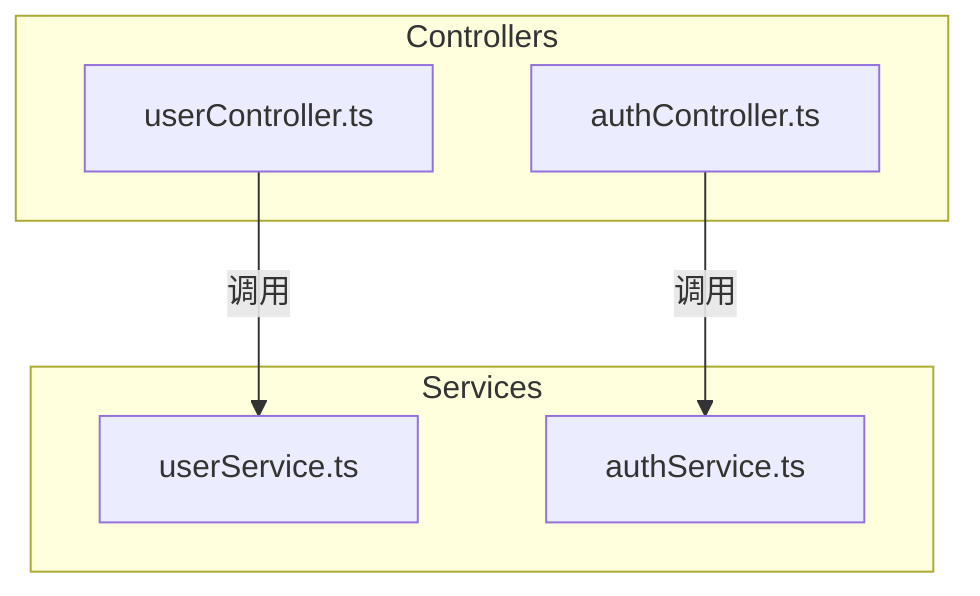

# 命令: `/init-index` - 初始化索引系统

## 🎯 使用场景

用户首次在项目中运行，或想要重建整个索引系统。

---

## 📋 执行步骤

### 步骤 0: 加载语言配置

**必须首先执行**，详见 [../core/i18n.md](../core/i18n.md)

1. 读取 `.claude/locale-config.json`
2. 加载语言文件到 `LANG` 对象
3. 如果失败，使用默认语言 `zh-CN`

---

### 步骤 1: 确认项目根目录

询问用户：
```
{{LANG.messages.commands.initIndex.confirmDirectory}}
```

将 `{directory}` 替换为当前工作目录（使用 `pwd` 或等效命令获取）。

**示例输出**:
- **zh-CN**: "当前目录是 /home/user/my-project, 确认这是项目根目录吗？"
- **en-US**: "Current directory is /home/user/my-project, confirm this is the project root?"

如果用户确认，继续；否则要求用户 cd 到正确目录后重试。

---

### 步骤 2: 扫描项目结构

输出: `{{LANG.messages.commands.initIndex.scanning}}`

使用 **Glob 工具**扫描所有代码文件：

**排除目录** (从 `LANG.skill.excludePatterns.directories`):
```
node_modules, .git, dist, build, .next, target, vendor, __pycache__, .cache
```

**支持的文件类型** (从 `LANG.skill.excludePatterns.fileTypes`):
```
.js, .jsx, .ts, .tsx, .py, .java, .kt, .rs, .go, .cpp, .c, .h, .php, .rb, .swift, .cs
```

**Glob 模式示例**:
```
**/*.{js,jsx,ts,tsx,py,java,kt,rs,go,cpp,c,h,php,rb,swift,cs}
```

**报告扫描结果**:

输出: `{{LANG.messages.commands.initIndex.found}}`

按语言分组统计：
```
{{LANG.messages.commands.initIndex.fileCount}}  # 替换 {language} 和 {count}
```

输出总计：
```
{{LANG.messages.commands.initIndex.totalFiles}}  # 替换 {count} 和 {folders}
```

**示例输出（zh-CN）**:
```
发现:
- JavaScript/TypeScript: 45 文件
- Python: 12 文件
- 总计 57 个代码文件，分布在 8 个文件夹
```

**示例输出（en-US）**:
```
Found:
- JavaScript/TypeScript: 45 files
- Python: 12 files
- Total 57 code files across 8 folders
```

---

### 步骤 3: 生成文件头注释

输出: `{{LANG.messages.commands.initIndex.generating}}`

对每个代码文件执行以下操作：

#### 3.1 读取文件内容

使用 **Read 工具**读取文件。

#### 3.2 分析依赖 (Input)

根据文件扩展名识别依赖语句：

| 语言 | 依赖关键字 | 示例 |
|------|----------|------|
| JavaScript/TypeScript | `import`, `require` | `import { foo } from './bar'` |
| Python | `import`, `from` | `from models import User` |
| Java/Kotlin | `import` | `import java.util.List;` |
| Rust | `use` | `use std::collections::HashMap;` |
| Go | `import` | `import "fmt"` |
| C/C++ | `#include` | `#include <vector>` |
| C# | `using` | `using System.Collections.Generic;` |
| PHP | `use`, `require` | `use Illuminate\Support\Facades\DB;` |
| Ruby | `require` | `require 'active_record'` |
| Swift | `import` | `import Foundation` |

提取依赖列表，去重并排序。

#### 3.3 分析导出 (Output)

根据语言识别导出语句：

| 语言 | 导出关键字 | 示例 |
|------|----------|------|
| JavaScript/TypeScript | `export`, `export default` | `export function foo()` |
| Python | `def`, `class` (顶层) | `def create_user():` |
| Java | `public class`, `public interface` | `public class UserService` |
| Rust | `pub fn`, `pub struct` | `pub fn create_user()` |
| Go | 大写开头的标识符 | `func CreateUser()` |
| C/C++ | 头文件中的声明 | `class UserService;` |
| C# | `public class`, `public interface` | `public class UserService` |
| PHP | `class`, `function` | `class UserService` |
| Ruby | `class`, `module`, `def` | `class UserService` |
| Swift | `public`, `open` | `public class UserService` |

提取导出列表。

#### 3.4 推断定位 (Pos)

根据文件路径和文件名推断：

**路径模式匹配** (使用 `LANG.skill.layerNames`):

| 路径包含 | 推断层级（zh-CN） | 推断层级（en-US） |
|---------|-----------------|------------------|
| `controller`, `route`, `api` | API层 | API Layer |
| `service`, `business` | 业务层 | Business Layer |
| `model`, `entity`, `dao` | 数据层 | Data Layer |
| `component`, `view`, `ui` | UI层 | UI Layer |
| `middleware`, `plugin` | 中间件层 | Middleware Layer |
| `util`, `helper`, `lib` | 工具层 | Utility Layer |

**文件名模式**:
- `*.service.*` → 服务层
- `*.controller.*` → 控制层
- `*.model.*` → 模型层
- `*.component.*` → UI组件

组合生成 Pos，格式：`{层级}-{职责}`

示例:
- `src/services/userService.ts` → "业务层-用户管理服务" / "Business Layer-User Service"
- `src/components/Button.tsx` → "UI层-按钮组件" / "UI Layer-Button Component"

#### 3.5 生成文件头注释

使用 `LANG.templates.{language}` 获取模板和占位符文本。

**JavaScript/TypeScript 模板**:
```javascript
/**
 * Input: {依赖列表}
 * Output: {导出列表}
 * Pos: {定位}
 *
 * {{LANG.templates.common.autoUpdateNotice}}
 */
```

**Python 模板**:
```python
"""
Input: {依赖列表}
Output: {导出列表}
Pos: {定位}

{{LANG.templates.common.autoUpdateNotice}}
"""
```

**其他语言模板**: 参见 `templates/` 目录

#### 3.6 插入或更新文件头

**检查是否已有文件头注释**:
- 如有：智能更新 Input/Output/Pos 字段，保留用户自定义内容
- 如无：在文件开头插入注释

使用 **Edit 工具**修改文件。

---

### 步骤 4: 生成 FOLDER_INDEX.md

对每个包含代码文件的文件夹（**从叶子到根**）：

#### 4.1 分析文件夹职责

根据文件名和路径推断文件夹的功能。

#### 4.2 生成架构说明（3行）

描述该文件夹的：
1. 层级定位
2. 采用的模式/架构
3. 关键特征

#### 4.3 列出文件清单

对每个文件：
- **地位**: 在文件夹中的角色
- **功能**: 提供的核心功能
- **依赖**: Input 列表摘要
- **被依赖**: 谁在使用这个文件（反向查找）

#### 4.4 添加自指声明

```markdown
---
{{LANG.messages.folderIndex.selfReference}}
```

**完整示例（zh-CN）**:
```markdown
# src/services 文件夹索引

## 架构说明
业务逻辑层，封装核心业务规则和数据访问逻辑。
采用服务模式，每个服务对应一个业务领域。

## 文件清单

### userService.ts
- **地位**: 用户管理核心服务
- **功能**: 用户 CRUD、认证、权限验证
- **依赖**: database, logger, User 模型
- **被依赖**: userController, authMiddleware

### authService.ts
- **地位**: 认证授权服务
- **功能**: JWT 生成、Token 验证、登录登出
- **依赖**: userService, config, bcrypt
- **被依赖**: authController, authMiddleware

---
⚠️ **自指声明**: 当本文件夹内容变化时，请更新此索引
```

使用 **Write 工具**创建 `FOLDER_INDEX.md`。

---

### 步骤 5: 生成 PROJECT_INDEX.md

在项目根目录创建全局索引。

#### 5.1 项目概览（3-5行）

分析项目整体：
- 项目类型（Web应用、库、CLI工具等）
- 技术栈
- 架构风格

#### 5.2 架构说明

描述整体分层架构，引用 `LANG.skill.layerNames`。

#### 5.3 目录结构

列出所有文件夹及其职责，链接到对应的 FOLDER_INDEX.md。

#### 5.4 依赖关系图 (Mermaid)

**生成规则**:
1. 解析所有文件的 import 关系
2. 按文件夹分组（使用 `subgraph`）
3. 最多显示 50 个节点（优先显示核心模块）
4. 标注循环依赖（如果存在）

**Mermaid 语法**:


#### 5.5 添加自指声明

```markdown
---
{{LANG.messages.projectIndex.selfReference}}
```

使用 **Write 工具**创建 `PROJECT_INDEX.md`。

---

### 步骤 6: 总结报告

输出: `{{LANG.messages.commands.initIndex.complete}}`

输出: `{{LANG.messages.commands.initIndex.summary}}`

统计结果：
```
- {{LANG.messages.commands.initIndex.fileHeaders}}      # 替换 {count}
- {{LANG.messages.commands.initIndex.folderIndexes}}    # 替换 {count}
- {{LANG.messages.commands.initIndex.projectIndex}}
- {{LANG.messages.commands.initIndex.dependencyGraph}}  # 替换 {nodes}
```

输出下一步建议：
```
{{LANG.messages.commands.initIndex.nextSteps}}
```

**示例输出（zh-CN）**:
```
✅ 完成！已创建 PROJECT_INDEX.md，请查看项目架构。

已生成:
- 57 个文件头注释
- 8 个 FOLDER_INDEX.md
- 1 个 PROJECT_INDEX.md
- 依赖关系图包含 25 个节点

下一步:
- 使用 /update-index 手动更新索引
- 使用 /check-index 检查一致性
```

---

## 🔍 错误处理

### 文件解析失败

如果某个文件无法解析依赖或导出：
1. 在文件头注释中标注: "⚠️ 自动分析失败，请手动编辑"
2. 继续处理其他文件
3. 在最终报告中列出所有解析失败的文件

### 权限问题

如果无法写入文件：
- 跳过该文件
- 记录错误
- 在报告中提示用户

### 扫描超时

如果扫描时间 > 2 分钟：
- 输出: `{{LANG.messages.errors.timeout}}`
- 询问用户是否继续

---

## 🎨 特殊场景

### 初始化时选择语言

在步骤 0 之前，如果检测到 `.claude/locale-config.json` 不存在：

询问用户:
```
Choose your language / 选择语言:
1. 简体中文 (zh-CN)
2. English (en-US)
```

根据用户选择创建配置文件，然后继续正常流程。

---

**参考**:
- 核心概念: [../core/concepts.md](../core/concepts.md)
- 国际化实现: [../core/i18n.md](../core/i18n.md)
- 模板文件: [../templates/](../templates/)
