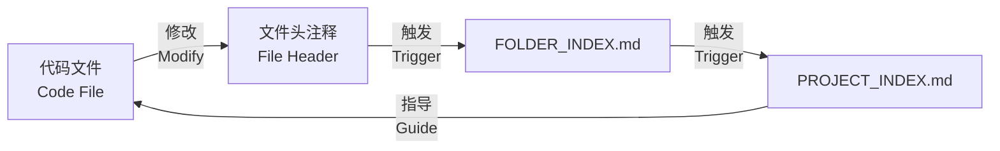

# 核心概念 (Core Concepts)

## 灵感来源

受《哥德尔、埃舍尔、巴赫》(Gödel, Escher, Bach) 启发的分形自指文档系统。

## 三大原则

### 1. 自相似性 (Self-Similarity)
每个层级都有相同的索引结构：
- **项目层**: PROJECT_INDEX.md
- **文件夹层**: FOLDER_INDEX.md
- **文件层**: 文件头注释

就像分形图案，无论放大或缩小，都能看到相似的结构。

### 2. 自指性 (Self-Reference)
每个文档都声明"当我变化时，更新我"：
- 文件修改 → 触发文件头更新
- 文件头更新 → 触发 FOLDER_INDEX 更新
- FOLDER_INDEX 更新 → 触发 PROJECT_INDEX 更新

形成自动维护的闭环。

### 3. 复调性 (Polyphony)
代码与文档相互呼应：
- **局部影响整体**: 一个文件的修改会反映到项目索引
- **整体影响局部**: 项目架构调整会指导文件组织
- **多声部共鸣**: Input/Output/Pos 形成完整的信息流

## 三级索引结构

```
PROJECT_INDEX.md (根索引 / Root Index)
  ├─ 项目概览 / Project Overview
  ├─ 架构说明 / Architecture
  ├─ 目录结构 / Directory Structure
  └─ 依赖关系图 (Mermaid) / Dependency Graph

FOLDER_INDEX.md (文件夹索引 / Folder Index)
  ├─ 3行架构说明 / 3-line Architecture Description
  ├─ 文件清单 / File List
  └─ 自指声明 / Self-Reference Declaration

文件头注释 (File Header Comment)
  ├─ Input: 依赖的外部内容 / External Dependencies
  ├─ Output: 对外提供的内容 / Exported Content
  ├─ Pos: 在系统中的定位 / Position in System
  └─ 自指声明 / Self-Reference Declaration
```

## 信息流动



## 关键术语

| 术语 | 中文 | 说明 |
|------|------|------|
| Input | Input | 文件依赖的外部内容（imports, requires） |
| Output | Output | 文件对外提供的内容（exports, public） |
| Pos | Pos | 文件在系统中的定位（层级-职责） |
| Self-Reference | 自指声明 | "更新我"的触发机制 |
| Structural Change | 结构性变更 | 影响依赖或导出的修改 |

## 支持的语言

代码文件类型：
- JavaScript/TypeScript: `.js`, `.jsx`, `.ts`, `.tsx`
- Python: `.py`
- Java/Kotlin: `.java`, `.kt`
- Rust: `.rs`
- Go: `.go`
- C/C++: `.c`, `.cpp`, `.h`
- PHP: `.php`
- Ruby: `.rb`
- Swift: `.swift`
- C#: `.cs`

## 排除模式

自动排除以下目录和文件：
- **依赖目录**: `node_modules`, `vendor`, `target`, `__pycache__`
- **构建目录**: `dist`, `build`, `.next`, `.cache`
- **版本控制**: `.git`
- **索引文件**: `PROJECT_INDEX.md`, `FOLDER_INDEX.md`

## 架构层级

常见的系统分层（Pos 字段使用）：

| 层级 | 中文 | English | 职责 |
|------|------|---------|------|
| API层 | API层 | API Layer | HTTP 接口、路由 |
| 业务层 | 业务层 | Business Layer | 业务逻辑、规则 |
| 数据层 | 数据层 | Data Layer | 数据访问、持久化 |
| UI层 | UI层 | UI Layer | 用户界面、组件 |
| 中间件层 | 中间件层 | Middleware Layer | 认证、日志、缓存 |
| 工具层 | 工具层 | Utility Layer | 通用工具函数 |

---

**参考**: 详见 [Gödel, Escher, Bach - 维基百科](https://en.wikipedia.org/wiki/G%C3%B6del,_Escher,_Bach)
