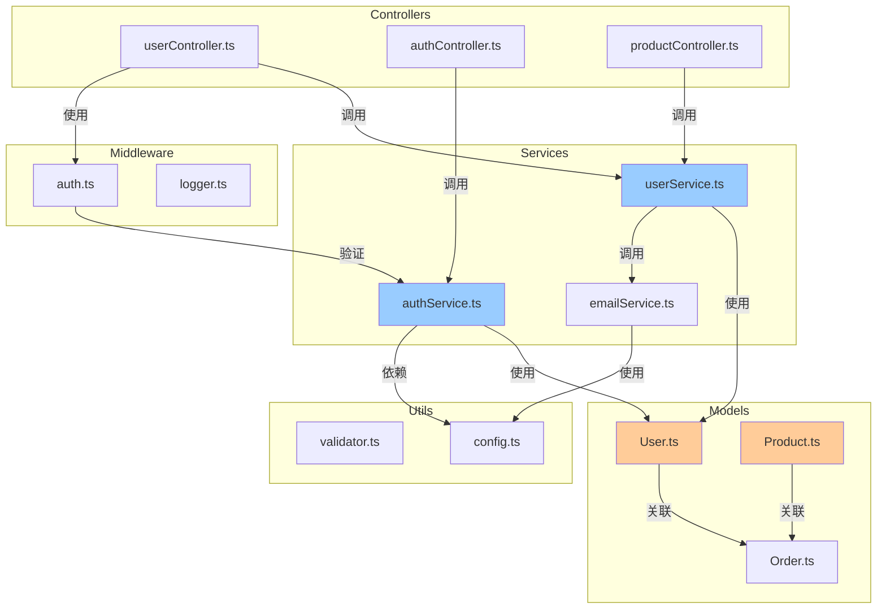

# 项目全局索引

## 项目概览
这是一个全栈 Web 应用示例，采用前后端分离架构。
后端使用 Node.js + Express + TypeScript，数据库为 PostgreSQL。
前端使用 React + TypeScript，状态管理使用 Redux Toolkit。

## 架构说明
采用经典三层架构：
- **API 层** (src/controllers): 处理 HTTP 请求，路由分发，参数验证
- **业务层** (src/services): 核心业务逻辑，事务管理，权限控制
- **数据层** (src/models): Sequelize 模型定义，数据库操作封装

跨层关注点：
- **中间件** (src/middleware): 认证、日志、错误处理
- **工具层** (src/utils): 通用工具函数、配置管理
- **类型定义** (src/types): TypeScript 类型和接口

## 目录结构

### src/controllers
- **地位**: HTTP 控制器层
- **功能**: 请求路由、参数验证、响应格式化
- **核心文件**: userController.ts, authController.ts, productController.ts
- [详见 FOLDER_INDEX.md](src/controllers/FOLDER_INDEX.md)

### src/services
- **地位**: 业务逻辑层
- **功能**: 核心业务规则、数据访问封装、事务处理
- **核心文件**: userService.ts, authService.ts, emailService.ts
- [详见 FOLDER_INDEX.md](src/services/FOLDER_INDEX.md)

### src/models
- **地位**: 数据模型层
- **功能**: Sequelize 模型定义、数据库表映射、关联关系
- **核心文件**: User.ts, Product.ts, Order.ts
- [详见 FOLDER_INDEX.md](src/models/FOLDER_INDEX.md)

### src/middleware
- **地位**: Express 中间件
- **功能**: 请求拦截、认证授权、日志记录、错误处理
- **核心文件**: auth.ts, logger.ts, errorHandler.ts
- [详见 FOLDER_INDEX.md](src/middleware/FOLDER_INDEX.md)

### src/utils
- **地位**: 工具函数库
- **功能**: 通用工具、配置管理、常量定义
- **核心文件**: validator.ts, logger.ts, config.ts
- [详见 FOLDER_INDEX.md](src/utils/FOLDER_INDEX.md)

### tests
- **地位**: 测试套件
- **功能**: 单元测试、集成测试、端到端测试
- **核心文件**: user.test.ts, auth.test.ts
- [详见 FOLDER_INDEX.md](tests/FOLDER_INDEX.md)

## 依赖关系图



## 核心流程

### 用户认证流程
1. 客户端 → authController.ts (POST /auth/login)
2. authController → authService.login()
3. authService → User.findOne() (查询数据库)
4. authService → bcrypt.compare() (验证密码)
5. authService → jwt.sign() (生成 Token)
6. authController ← Token (返回给客户端)

### 数据访问流程
1. Controller 接收请求
2. Middleware 验证权限
3. Service 执行业务逻辑
4. Model 操作数据库
5. Service 返回结果
6. Controller 格式化响应

## 技术栈

- **后端框架**: Express 4.18
- **ORM**: Sequelize 6.x
- **认证**: JWT + bcrypt
- **数据库**: PostgreSQL 14
- **日志**: Winston
- **测试**: Jest + Supertest
- **类型检查**: TypeScript 5.0

## 环境要求

- Node.js >= 18.0
- PostgreSQL >= 14
- npm >= 9.0

## 快速开始

```bash
# 安装依赖
npm install

# 配置环境变量
cp .env.example .env

# 运行数据库迁移
npm run migrate

# 启动开发服务器
npm run dev

# 运行测试
npm test
```

---
⚠️ **自指声明**: 任何功能、架构、写法更新必须在工作结束后更新此文档
